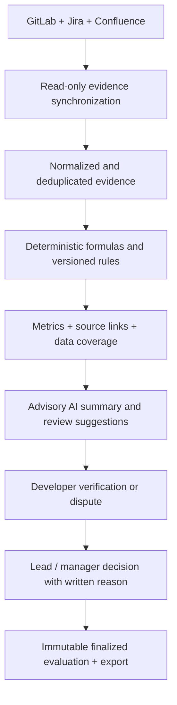

# Engineering Career Matrix

An evidence-backed platform for transparent and reproducible engineering evaluations.

The platform collects activity from Jira, GitLab, and Confluence, converts it into deterministic metrics, shows the exact evidence and data coverage behind every result, and keeps AI and management judgment in clearly separated advisory and decision layers.

It is designed to support career conversations—not to rank people by activity volume or replace engineering judgment.

## Product principles

1. **Evidence before opinion.** Every automatic result links back to source activity.
2. **Deterministic before AI.** Formulas, thresholds, attribution, and inclusion rules are normal code and versioned configuration.
3. **Missing data is not failure.** `NO_DATA` and `SOURCE_UNAVAILABLE` are different from `FAIL`.
4. **People can verify the result.** Developers see the same formulas and evidence as leads and managers.
5. **Human judgment remains explicit.** Qualitative criteria require review and recorded reasoning.
6. **AI is advisory only.** It summarizes supplied facts; it cannot change a metric, assign a level, or finalize an evaluation.
7. **Rules are versioned.** A completed evaluation remains reproducible even after the career matrix changes.
8. **No hidden productivity score.** Story points, comments, commits, and reviews are supporting indicators, not interchangeable measures of individual value.

## Evaluation pipeline



The important boundary is between calculation and interpretation:

- connectors determine what happened in a source system;
- deterministic rules calculate the measurable result;
- AI explains the already-calculated facts;
- people decide how the evidence should influence a career decision.

## Normal user flow

For a lead or manager, the normal flow is intentionally small:

1. Enter the developer's corporate email.
2. Select an inclusive `From` / `To` period and the level being evaluated.
3. Select **Collect evidence and create report**.
4. The backend discovers exact source identities, synchronizes only that employee, evaluates the published rule version, and returns the report.
5. Open individual evidence records when verification is needed.
6. Record a manager decision or allow the developer to dispute missing or incorrect evidence.
7. Finalize only after human review.

The same flow can create reports for a quarter, a single day, or any custom date range. Date boundaries use the IANA timezone selected in the UI. Leave and absence normalization is intentionally not applied.

Thresholds are currently not prorated. A quarterly threshold is promotion-ready only for a full quarter; a shorter custom range is an evidence snapshot using the same published threshold. Likewise, monthly review thresholds are not automatically multiplied by the number of months. Period-scaling rules must be explicitly agreed and versioned before automation.

## Identity discovery

Corporate email is the human-facing identifier. Stable source-system IDs are stored after an unambiguous match:

- Jira is searched globally by email and persists the Atlassian `accountId`.
- Confluence reuses the verified Atlassian `accountId`; Atlassian Cloud no longer supports lookup by the old username parameter.
- GitLab first searches by email, then by the email local part because private GitLab profiles frequently hide email. A username equal to the email local part is considered an exact match.

Only a single exact match is automatically confirmed. Ambiguous candidates stay unverified and require an administrator. Repository, project, and space access remains limited by the configured read-only account permissions.

## How metrics are calculated

### Formula model

Each criterion defines:

| Field | Meaning |
|---|---|
| `sourceTool` | Evidence owner: `jira`, `gitlab`, or `confluence` |
| `metricKey` | Stable normalized evidence type, such as `story_points` |
| `aggregation` | `SUM`, `COUNT`, or `RATIO` |
| `operator` | `>=`, `>`, `=`, `<`, or `<=` |
| `threshold` | Expected value for the level and rule version |
| `evaluationType` | Automatic, automatic with review, manager reviewed, or evidence only |
| `levelCode` / `version` | Published matrix version used for reproducibility |

Examples:

```text
Velocity       = SUM(jira.story_points)
Reviews        = COUNT(gitlab.review_comments)
Documentation  = COUNT(confluence.documentation_updates)
QA Ratio       = COUNT(jira.qa_defects)
                 / COUNT(jira.qa_tested_completed_tasks) * 100
```

An automatic criterion is compared with its threshold only when relevant evidence is available. Manager-reviewed and evidence-only criteria always remain `NEEDS_REVIEW`.

### Jira velocity

Velocity is based on completion events—not issue update time or the issue's current status label.

An implementation issue is included when all of the following are true:

1. the verified developer was the assignee;
2. Jira history contains a transition into a status whose `statusCategory` is `Done` inside the selected period;
3. `Resolution` is exactly `Done`;
4. the issue is not in the `QA` project.

The connector discovers Story Point fields from Jira metadata across available project contexts. A completed task with missing or zero Story Points still counts as a completed task and appears as `completed_tasks_without_sp`; it contributes zero to velocity. This keeps data-quality gaps visible instead of silently dropping work.

`Duplicate`, `Cancelled`, `Won't Do`, empty, and any other resolution are excluded from velocity and emitted as `completed_tasks_excluded_resolution` evidence with a reason.

```text
Velocity = sum of Story Points on included completed implementation issues
```

No project allow-list is applied. The connector searches all Jira projects visible to the configured account, including ODIN and JORD.

### Jira activity stream

The evidence timeline is deliberately wider than assigned issues. It collects authored or performed activity such as:

- issue creation;
- comments;
- worklogs;
- status transitions;
- other field changes;
- activity on issues owned by other people;
- completed assigned work.

This activity is evidence and context. It does not automatically become velocity or a performance score.

### QA ratio and attribution

```text
QA Ratio = attributed QA defects
           / completed implementation tasks with a linked QA task * 100
```

The denominator intentionally includes only completed implementation tasks for which a QA task exists. Tasks without a QA relationship do not make the ratio look artificially better.

Defect attribution follows deterministic rules:

1. If the QA defect links directly to a specific implementation issue, attribute it to that issue's developer.
2. Otherwise, if all relevant implementation issues have one verified assignee, infer that assignee.
3. Otherwise, emit `qa_defects_needs_review`; do not charge the defect to any developer automatically.

Jira `Priority` is preserved as a breakdown (`qa_defects_<priority>`). It is not converted into an arbitrary weighted score. Production incidents are not attributed automatically when causality cannot be proven from source relationships.

### GitLab evidence

The connector searches globally across repositories visible to the token and records:

- merged merge requests authored by the developer;
- review comments;
- commit activity;
- project/repository context and source URLs.

Review-comment counts are candidate evidence. “Meaningful review” cannot be determined safely from quantity alone; this criterion is configured as automatic-with-review. AI may categorize the review content, but a person confirms the engineering value.

### Confluence evidence

The connector records pages updated by the verified Atlassian account within the selected period as `documentation_updates` and preserves page/version context.

Counts show documentation activity, not documentation quality. Technical relevance, ownership, workshops, demos, and onboarding impact remain reviewable evidence unless the organization defines a stronger deterministic signal.

## Data coverage and result states

Every criterion reports both a result and coverage:

| State | Meaning |
|---|---|
| `PASS` | Available evidence satisfies the published formula |
| `FAIL` | Available evidence does not satisfy the published formula |
| `NO_DATA` | The source is healthy, but no qualifying evidence exists for the rule and period |
| `SOURCE_UNAVAILABLE` | The connector is missing, unauthorized, or unhealthy |
| `NEEDS_REVIEW` | Evidence exists, but the criterion or attribution requires human judgment |

A metric must never become `FAIL` merely because the integration is unavailable. The report exposes formula, measured value, threshold, coverage, and source evidence so the result can be reproduced.

## Career matrix currently seeded

Flyway publishes the initial five levels and their measurable criteria:

| Level | Deterministic / review-supported criteria |
|---|---|
| Junior | Velocity ≥ 150 SP; QA ratio < 25%; ≥ 1 documentation contribution |
| Mid | Velocity ≥ 250 SP; QA ratio < 15%; ≥ 20 review comments/month; ≥ 2 documentation contributions |
| Mid II | Velocity ≥ 250 SP; QA ratio < 12%; ≥ 30 review comments/month; cross-project versatility review |
| Senior | Velocity ≥ 150 SP; QA ratio < 10%; ≥ 40 final audits; ≥ 5 analysis approvals |
| Principal | Core velocity ≥ 100 SP; QA ratio < 5%; ≥ 40 final audits; ≥ 10 analysis approvals; ≥ 1 strategic initiative |

The platform does not claim that every row is already fully measurable. The following require organization-specific definitions before they can be deterministic:

- what identifies a core project or core system;
- what Jira issue type, link, workflow action, or approval represents a final task audit;
- what represents a major analysis approval;
- what evidence qualifies as a strategic platform/process initiative;
- how ownership, mentoring, operational maturity, and cross-team coordination are reviewed.

Until those definitions exist, the honest result is `NO_DATA` or `NEEDS_REVIEW`, not an invented score.

## AI layer

AI runs only after deterministic calculation. It receives structured evaluation facts and may:

- summarize strengths, gaps, and missing coverage;
- group evidence into understandable themes;
- suggest which evidence a manager should inspect;
- draft a neutral review narrative;
- flag possible ambiguity or missing context.

AI must not:

- alter evidence or formulas;
- infer missing Story Points;
- attribute an ambiguous defect;
- decide `PASS` / `FAIL`;
- assign or recommend a promotion level as an automated decision;
- finalize an evaluation.

The current implementation uses temperature `0`, instructs the model to summarize only supplied facts, returns an explicit advisory disclaimer, and falls back to a deterministic text summary when AI is unavailable.

## Verification, disputes, and decisions

Developers and authorized reviewers see the same calculation. A developer can dispute a criterion and explain missing or incorrect evidence. Leads and managers record decisions with a written reason. Decisions and relevant actions are auditable.

Finalization makes the evaluation immutable. PDF and Excel exports preserve the reviewed result for sharing and audit.

## Roles and access

| Role | Intended access |
|---|---|
| `DEVELOPER` | Own report, evidence, and disputes |
| `TEAM_LEAD` | Reports for direct reports |
| `ENGINEERING_MANAGER` | Team reports, decisions, and finalization |
| `EVALUATOR_ADMIN` | Level and criterion versioning |
| `INTEGRATION_ADMIN` | Connector health, identity confirmation, and synchronization |
| `ORGANIZATION_ADMIN` | Employee provisioning and organization configuration |
| `AUDITOR` / `HR` | Authorized read/report access according to policy |

The backend enforces RBAC on every protected endpoint. Hiding an advanced form in Angular is UX—not the security boundary.

## Administration UX

Administration first shows the currently published matrix. Normal report calculation does not live there.

Advanced actions are collapsed and separated by responsibility:

- **People onboarding** is for exceptional manual provisioning. The current build requires an employee record; a production directory/SSO adapter should provision it automatically.
- **Matrix versioning** is for deliberate publication of a new level or criterion version.

Existing published criteria should be versioned rather than silently edited. A finalized historical evaluation continues to reference its original rule version.

## Connector and secret setup

Copy the example configuration:

```bash
cp .env.example .env
```

Configure least-privilege, read-only credentials:

1. GitLab: create a personal access token with `read_api`; set `GITLAB_URL` and `GITLAB_TOKEN`.
2. Jira: create an Atlassian API token; set `JIRA_URL`, `JIRA_EMAIL`, and `JIRA_TOKEN`.
3. Confluence: reuse the Atlassian identity where appropriate; set `CONFLUENCE_URL`, `CONFLUENCE_EMAIL`, and `CONFLUENCE_TOKEN`.

Local tokens live only in the project-root `.env`, which is ignored by Git. They are read by the backend and never returned to Angular or stored in browser storage. A shared deployment must inject secrets from a deployment secret manager. Per-user credentials in a shared deployment require OAuth or encrypted server-side storage.

## Run with Docker

```bash
docker compose up --build -d
```

Open `http://localhost:8088`.

Docker Compose runs:

- Angular behind the frontend container;
- Spring Boot on the internal network;
- PostgreSQL 17 with a persistent `evaluator-data` volume.

For production:

- set `DEV_AUTH_ENABLED=false`;
- configure `OIDC_ISSUER_URI` and role claims;
- use TLS and a real secret manager;
- use a strong PostgreSQL password and managed backups;
- review connector token visibility and rate limits;
- define data-retention and employee-access policies;
- run database migrations before serving traffic.

## Local development

Requirements: Java 21, Maven, Node.js, and npm.

```bash
# Backend
cd backend
mvn spring-boot:run

# Frontend
cd frontend
npm install
npm start
```

Without `DATABASE_URL`, the backend uses an in-memory H2 database. H2 data disappears on backend restart; use Docker/PostgreSQL for persistent local data.

## Quality and tests

```bash
# Java compilation, tests, Flyway/JPA integration, and formatting verification
mvn verify

# Strict TypeScript, Prettier, ESLint, and production Angular build
cd frontend
npm run quality

# End-to-end report and administration workflows
cd ../e2e
npm test
```

Formatting:

```bash
mvn -pl backend spotless:apply
npm run format --prefix frontend
```

## Backend structure

```text
backend/src/main/java/com/pronet/evaluator/
├── config/       immutable, type-safe configuration properties
├── domain/       one JPA entity or enum per file
├── repository/   one Spring Data repository per aggregate
└── application   connectors, services, API validation, RBAC, export, and AI summary
```

New source integrations implement `EngineeringConnector`:

```java
interface EngineeringConnector {
    String key();
    ConnectorHealth testConnection();
    List<IdentityCandidate> discoverUsers(String email);
    List<EvidenceInput> syncEvidence(String externalUserId, Instant from, Instant to);
}
```

Connector responsibilities stop at identity discovery and normalized evidence. Career rules remain in the deterministic evaluation layer, which allows adding Slack, incident management, CI/CD, or other tools without embedding promotion logic inside each connector.

## Recommended implementation process

When adding or changing a metric:

1. Agree on the business definition and exclusions with developers and leads.
2. Write examples for included, excluded, ambiguous, and missing-data cases.
3. Define a stable normalized `metricKey` and source evidence schema.
4. Implement the connector extraction with pagination, deduplication, and rate-limit handling.
5. Implement the deterministic formula independently of AI.
6. Add unit, integration, and end-to-end tests using realistic edge cases.
7. Show formula and evidence in the developer-facing UI.
8. Pilot the metric and compare results with manual reviews.
9. Publish a new rule version only after calibration.
10. Keep ambiguous evidence in `NEEDS_REVIEW`; never force it into a score.

This process is more important than maximizing the number of automatically measured criteria. A smaller set of trustworthy metrics produces a fairer evaluation than a large set of weak proxies.
